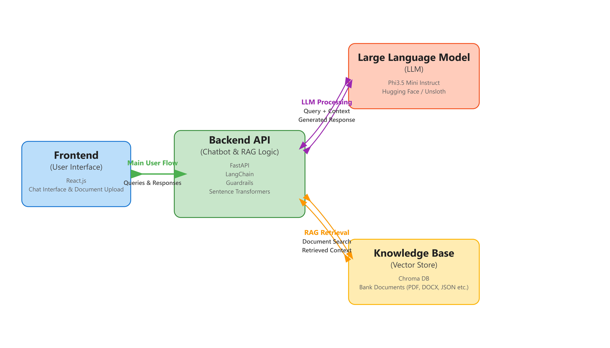
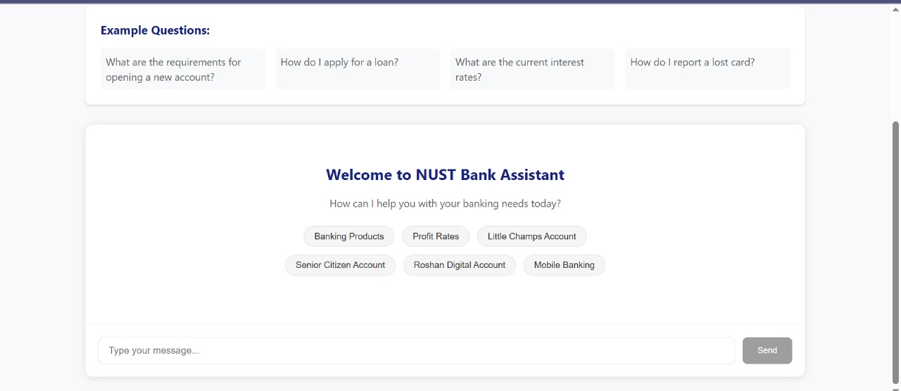

# NUST Bank Chatbot: A Retrieval-Augmented Generation (RAG) System

## 1. Project Overview

The NUST Bank Chatbot is an intelligent conversational agent designed to provide instant and accurate support for NUST Bank customers. This project leverages a Retrieval-Augmented Generation (RAG) system to enhance customer service efficiency by automating responses to frequently asked questions and providing personalized information based on a dynamic knowledge base.

Traditional chatbots often encounter limitations in providing nuanced, up-to-date, or highly domain-specific information, which can lead to frustrating user experiences. This project addresses these challenges by integrating a RAG system that retrieves precise information from a curated document set before generating responses, ensuring higher accuracy and relevance in interactions.

### Key Value Proposition
- **Reliable Information Delivery**: Conversational banking context with high accuracy
- **Dynamic Knowledge Base**: Seamless integration of new documents without code modifications
- **Reduced Hallucinations**: Fact-based responses grounded in bank-specific documentation

## 2. Features

### 🤖 Intelligent Conversational Interface
- User-friendly chat window for natural language queries
- Support for various banking services including account inquiries, loan information, and general banking questions
- Real-time response generation

### 🎯 Retrieval-Augmented Generation (RAG) for Accuracy
- Responses augmented with precise information from bank-specific knowledge base
- Significantly reduced likelihood of incorrect or fabricated information
- Improved factual accuracy and contextual relevance

### 📁 Dynamic Knowledge Base via Document Upload
- Dedicated document upload functionality
- Support for policy updates, FAQs, and product brochures
- Automatic processing and indexing of new documents
- No code changes required for knowledge base updates

### 🏗️ Scalable Architecture
- Modular design separating frontend from backend processing
- Independent development, deployment, and scaling capabilities
- Maintainable and extensible system architecture

## 3. Technical Architecture

The NUST Bank Chatbot employs a modular architecture that separates the user-facing frontend application from the backend RAG processing logic.

### System Components

| Component | Description | Primary Technologies |
|-----------|-------------|---------------------|
| **Frontend Application** | User interface for chatbot interaction and document uploads | React.js, HTML, CSS |
| **Backend API** | Orchestrates RAG, handles user queries, and document processing | FastAPI, LangChain, Guardrails, Sentence Transformers |
| **Knowledge Base** | Stores vectorized document embeddings for efficient retrieval | Chroma DB, Document Loaders |
| **Large Language Model** | Generates conversational responses based on retrieved context | Phi3.5 Mini Instruct, Hugging Face/Unsloth |

### Architecture Overview



## 4. Retrieval-Augmented Generation (RAG) System

The RAG pipeline consists of five key stages:

### 1. Document Ingestion and Preprocessing
- Parse various document formats (PDF, DOCX, TXT, JSON, etc)
- Extract and clean raw text content
- Split text into manageable chunks for optimal retrieval

### 2. Embedding Generation
- Transform text chunks into numerical vectors using pre-trained models
- Capture semantic meaning and contextual relationships
- Utilize Sentence Transformers or similar embedding models

### 3. Vector Store Indexing
- Store embeddings in specialized vector database (Chroma DB)
- Optimize for rapid similarity searches
- Enable semantic rather than keyword-based retrieval

### 4. Retrieval
- Convert user queries into embeddings
- Perform similarity search against indexed vector store
- Retrieve most semantically relevant document chunks

### 5. Generation
- Combine retrieved context with user query
- Generate coherent responses using Large Language Model (phi3.5-mini-instruct)
- Ensure factual accuracy through contextual grounding

## 5. Frontend Application

The frontend application serves as the primary interface for user interaction and document management.

### User Interface Features
- **Chatbot Interface**: Clean, intuitive chat window with conversation history
- **Document Upload Tab**: Dedicated section for uploading new documents


## 6. UI Screenshots

### Chatbot Interface

*Main conversational interface showing input field, message history, and chatbot responses*

### Document Upload Tab

*Document upload section with file selection, upload button*

## 7. Setup and Installation

### Prerequisites
- **Python 3.8+**: For Backend/RAG system
- **Node.js & npm**: For Frontend application
- **Git**: For repository cloning

### Backend Setup

1. **Clone the repository**
   ```bash
   git clone https://github.com/visha1Sagar/NUST_Bank_Chatbot.git
   cd NUST_Bank_Chatbot
   ```

2. **Create and activate virtual environment**
   ```bash
   python -m venv venv
   source venv/bin/activate  # On Windows: venv\Scripts\activate
   ```

4. **Run notebook**
   Run all the cells of notebook

### Frontend Setup

1. **Navigate to frontend directory**
   ```bash
   cd nustbank
   ```

2. **Install Node.js dependencies**
   ```bash
   npm install
   ```

4. **Run the frontend development server**
   ```bash
   npm start
   ```

## 8. Usage Guide

### Interacting with the Chatbot

1. **Access the application**: Navigate to `http://localhost:3000` in your web browser
2. **Enter your query**: Type your banking-related question in the input field
3. **Submit the query**: Press Enter or click the "Send" button
4. **Receive response**: View the AI-generated response in the chat window

### Uploading Documents

1. **Navigate to upload section**: Click on the "Document Upload Tab"
2. **Select a document**: Click "Browse" or "Choose File" to select documents (PDF, TXT, DOCX)
3. **Initiate upload**: Click the "Upload" button

## 9. Future Enhancements

### Advanced RAG Capabilities
- **Sophisticated Retrieval**: Implement re-ranking and hybrid search techniques
- **Diverse Document Support**: Add OCR for images and audio transcript processing
- **Real-time Integration**: Connect with external APIs for live data

### Improved User Experience
- **Voice Input/Output**: Add speech recognition and text-to-speech capabilities
- **Multi-turn Conversations**: Enhanced context tracking across conversation turns
- **Personalization**: User profile-based response customization

### Scalability and Deployment
- **Containerization**: Docker containerization for consistent deployment
- **Cloud Deployment**: AWS/Azure/GCP deployment strategies
- **Monitoring**: Comprehensive logging and performance monitoring

### Security and Compliance
- **Authentication**: Robust user authentication and authorization
- **Data Encryption**: End-to-end encryption for sensitive banking data
- **Regulatory Compliance**: GDPR, PCI DSS compliance implementation

---

## Project Structure
```
NUST_Bank_Chatbot/
├── nustbank/                 # Frontend React application
├── PArt-1-Finetuning/        # Finetuning of the model for domain adaption
├── RAG_Part.ipynb            # RAG & backend
├── README.md                # Project documentation
```

## Support

For questions, issues, or support, please open an issue in the GitHub repository or contact the development team.

---

*Built with ❤️ for NUST Bank customers by Asfand, Yameen and Vishal*